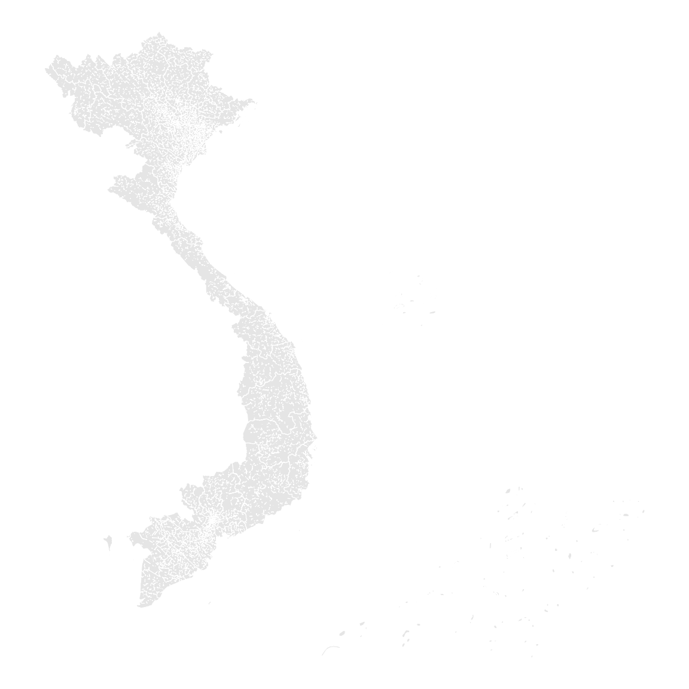
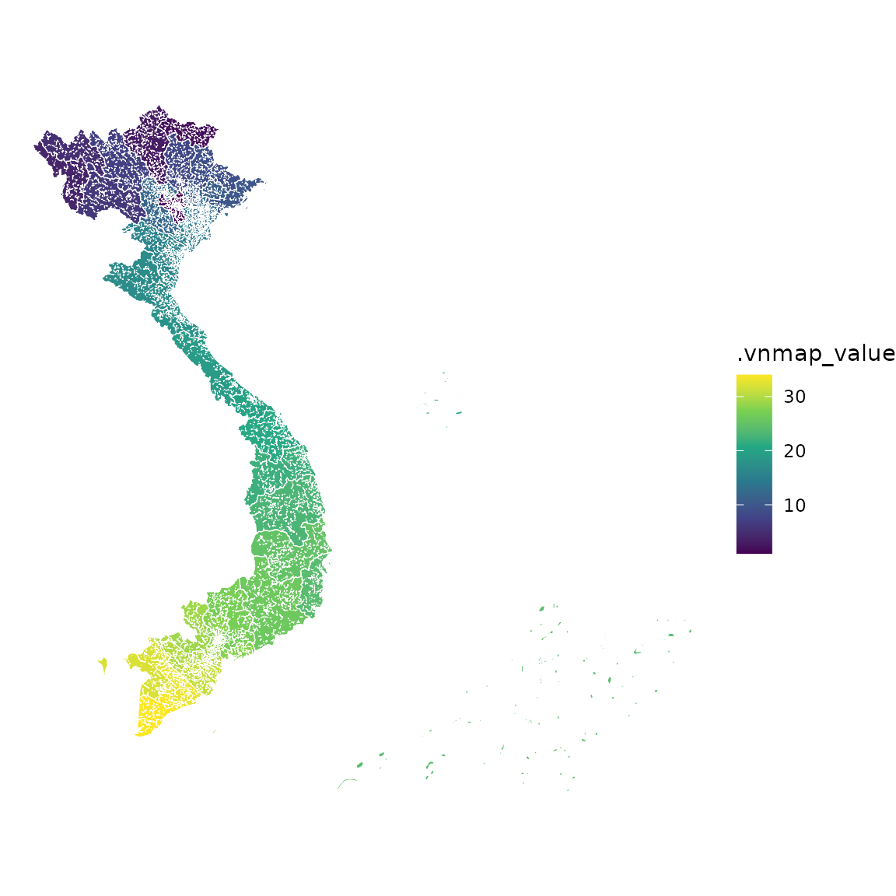
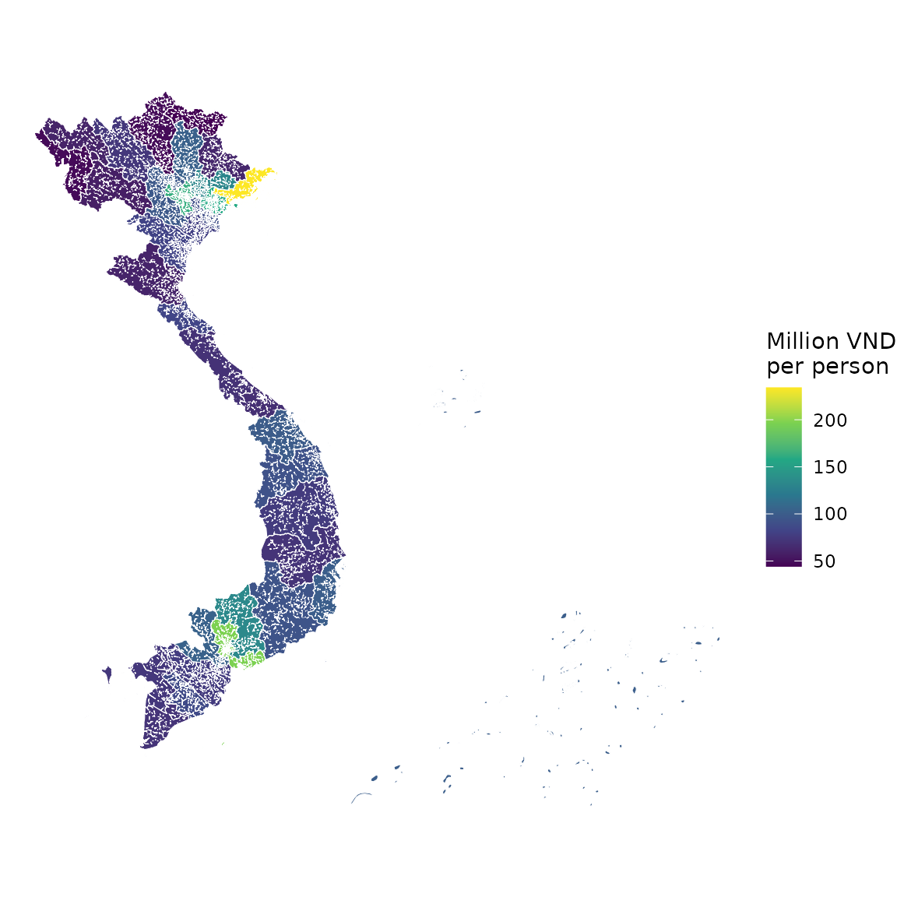
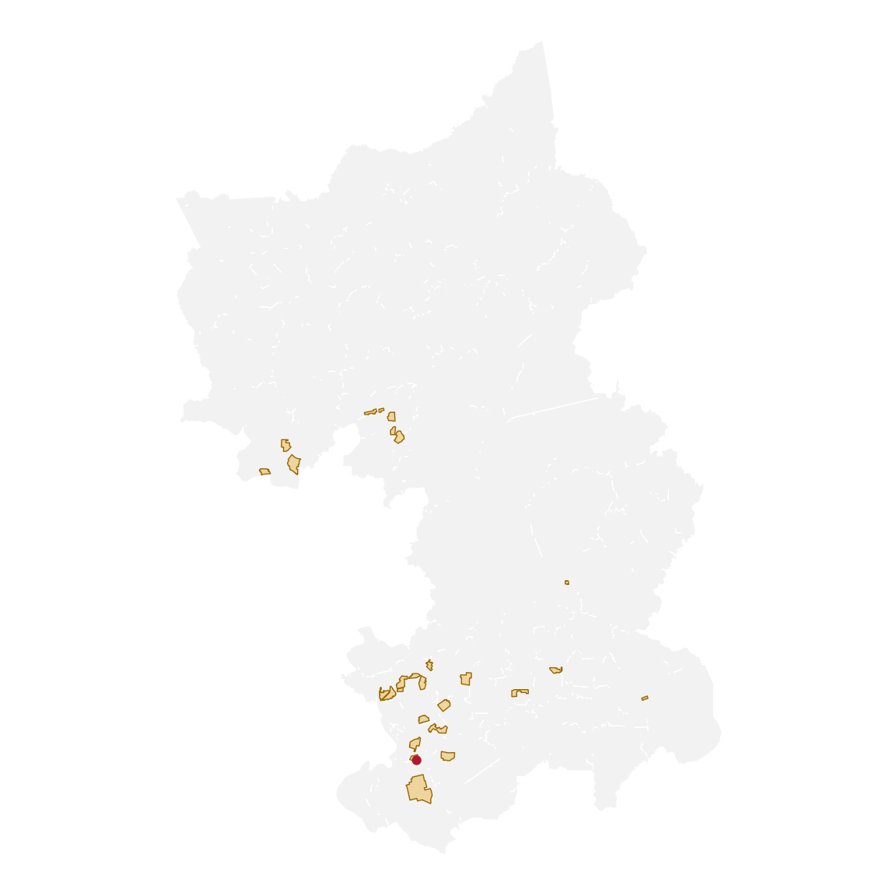

# Mapping Viet Nam with vnmap

`vnmap` draws publication-ready choropleth maps of Viet Nam and accounts
for the July 2025 administrative reform, which replaced the 63
provincial-level units with 34. It follows the compact API of
[`usmap`](https://usmap.dev).

``` r

library(vnmap)
library(ggplot2)
```

## An outline map

[`plot_vnmap()`](https://ura8107.github.io/vnmap/reference/plot_vnmap.md)
with no data draws the current 34-unit outline.

``` r

plot_vnmap(color = "white", linewidth = 0.2)
```



## Joining your own data

Supply a data frame, the column holding the values, and the column that
identifies each unit. Identifiers may be Vietnamese names (with or
without diacritics), English names, common aliases, or official codes.

``` r

example <- data.frame(
  province = province_info()$name_en,
  value = seq_len(34)
)

plot_vnmap(
  data = example, values = "value", id = "province",
  color = "white", linewidth = 0.2
) +
  scale_fill_viridis_c()
```



The package bundles official 2024 indicators, so a GRDP-per-capita map
is one call away.

``` r

data(province_stats_2024)

plot_vnmap(
  data = province_stats_2024,
  values = "grdp_per_capita_million_vnd",
  id = "code",
  color = "white", linewidth = 0.2
) +
  scale_fill_viridis_c(name = "Million VND\nper person")
```



## Choosing a geography

The current 34-unit geography is the default. The 63-unit geography used
before 1 July 2025 remains available for historical data.

``` r

vn_map()                          # 34 current units as an sf object
vn_map("provinces_63")            # historical 63-unit geography
```

Always choose the geography that matches the reference period and coding
scheme of your data.

## Current communes and the 2025 transition

The bundled commune layer is an observed 25 July 2026 snapshot. Its
province polygons are dissolved from the same source, so current parent
and child boundaries are spatially compatible. `valid_from` is
deliberately missing: the source snapshot does not establish a legal
effective date for every code.

``` r

hanoi <- vn_map("communes", province = "Ha Noi")
hanoi[c("code", "name_vi", "geography_vintage", "snapshot_date")]
```

The NSO July 2025 conversion workbook is not bundled because
redistribution terms have not been established. Downloading is explicit.
The resulting table is many-to-many and reports whether each 2025 target
code is present in the bundled 2026 snapshot; it contains no inferred
area or population weights.

``` r

path <- download_administrative_crosswalk(tempfile(fileext = ".xlsx"))
cw <- administrative_crosswalk(path, province = "Ha Noi")
table(cw$relation, cw$current_code_status)
attr(cw, "current_snapshot_only_codes")
```

## Transport and logistics facilities

[`infrastructure()`](https://ura8107.github.io/vnmap/reference/infrastructure.md)
provides pinned redistributable aerodrome, port, border-control and
trunk-network geometry. These are community mapping rather than an
official register. Categories remain neutral, entity aliases and
border-control component roles are retained, and unknown lifecycle
status is preserved instead of treating every mapped feature as
operational.

``` r

table(infrastructure(crs = 4326)$infrastructure_type)
#> 
#>        aerodrome   border_control       expressway national_highway 
#>               42               32             7650            22648 
#>             port          railway 
#>               80             3739

plot_vnmap() +
  geom_infrastructure(type = c("aerodrome", "port"))
#> Coordinate system already present.
#> ℹ Adding new coordinate system, which will replace the existing one.
```


`aerodrome` does not establish commercial service and `port` does not
establish seaport status. Inspect `infrastructure_class`,
`service_type`, `status_source`, `facility_roles`, and
`location_accuracy` before analysis. Province filtering uses spatial
intersection, so cross-province network segments are retained. Network
counts are OSM way segments rather than route counts. Lines lacking the
expected motorway, `CT`, `QL`, or railway tags are outside this
snapshot’s selection and should not be interpreted as confirmed network
absences. For railways, filter `class = "main_line"` only when
explicitly tagged `usage=main`; yards, sidings, spurs, industrial and
unspecified lines remain separate. Network `province_code` is
deliberately missing because ways can span boundaries; `province_codes`
and province filtering use polygon intersections.

## Socio-economic regions

Every unit is tagged with one of the six General Statistics Office
socio-economic regions. Filter a map to a region with `region`, or look
the region up directly.

``` r

plot_vnmap(region = "MRD", labels = TRUE)
#> Warning in layer_sf(geom = GeomSf, data = data, mapping = mapping, stat = stat,
#> : Ignoring unknown parameters: `geom` and `check_overlap`
#> Warning in layer_sf(geom = GeomSf, data = data, mapping = mapping, stat = stat,
#> : Ignoring unknown aesthetics: label
```


``` r


province_region(c("HCMC", "Can Tho"))
#> [1] "Southeast"          "Mekong River Delta"
head(province_info()[c("name_en", "region_code", "region_en")])
#>       name_en region_code                       region_en
#> 1      Ha Noi         RRD                 Red River Delta
#> 2    Cao Bang         NMM Northern Midlands and Mountains
#> 3 Tuyen Quang         NMM Northern Midlands and Mountains
#> 4   Dien Bien         NMM Northern Midlands and Mountains
#> 5    Lai Chau         NMM Northern Midlands and Mountains
#> 6      Son La         NMM Northern Midlands and Mountains
```

Assignments for the 63-unit geography are the official ones; assignments
for the merged 2025 units follow their dominant predecessor by
population.

## Industrial parks

[`industrial_parks()`](https://ura8107.github.io/vnmap/reference/industrial_parks.md)
returns a provenance-rich `sf` layer. Use `province`, `category`,
`status`, or `include` to narrow it, and choose either the best
available geometry, polygons only, or representative points.

``` r

head(industrial_parks(province = "Dong Nai", geometry = "point"))
#> Simple feature collection with 6 features and 20 fields
#> Geometry type: POINT
#> Dimension:     XY
#> Bounding box:  xmin: 674824.8 ymin: 1192445 xmax: 721647.4 ymax: 1269430
#> Projected CRS: VN-2000 / UTM zone 48N
#>                       id                               name_vi
#> 271 osm_node_12535607272 Amata City Long Thanh Industrial Park
#> 272    osm_way_597919509          Chon Thanh I Industrial Zone
#> 273    osm_way_583464295                 Khu công nghiệp Amata
#> 274   osm_way_1462512216          Khu công nghiệp Bắc Đồng Phú
#> 275   osm_way_1462513965    Khu công nghiệp Bắc Đồng Phú Khu B
#> 276    osm_way_321136900               Khu công nghiệp Bàu Xéo
#>                     name_en                         aliases        category
#> 271                    <NA>                            <NA> industrial_park
#> 272                    <NA>                            <NA> industrial_park
#> 273                    <NA> Khu công nghiệp Amata (mở rộng) industrial_park
#> 274                    <NA>                            <NA> industrial_park
#> 275                    <NA>                            <NA> industrial_park
#> 276 Bau Xeo Industrial Park         Bau Xeo Industrial Park industrial_park
#>     province_code province_en former_province_code      status  area_ha
#> 271            75    Dong Nai                   75     unknown       NA
#> 272            75    Dong Nai                   70 operational 246.3112
#> 273            75    Dong Nai                   75 operational 600.1156
#> 274            75    Dong Nai                   70 operational 167.1046
#> 275            75    Dong Nai                   70 operational 408.1200
#> 276            75    Dong Nai                   75 operational 524.0327
#>     developer
#> 271      <NA>
#> 272      <NA>
#> 273      <NA>
#> 274      <NA>
#> 275      <NA>
#> 276      <NA>
#>                                                                   website
#> 271 https://directorsdirectory.com/amata-city-long-thanh-industrial-park/
#> 272                                                                  <NA>
#> 273                                                                  <NA>
#> 274                                                                  <NA>
#> 275                                                                  <NA>
#> 276                                                                  <NA>
#>     geometry_type location_accuracy part_count
#> 271         point          locality          1
#> 272         point              site          1
#> 273         point              site          2
#> 274         point              site          1
#> 275         point              site          1
#> 276         point              site          1
#>                                  osm_ids        source
#> 271                 osm_node_12535607272 OpenStreetMap
#> 272                    osm_way_597919509 OpenStreetMap
#> 273 osm_way_1016015905|osm_way_583464295 OpenStreetMap
#> 274                   osm_way_1462512216 OpenStreetMap
#> 275                   osm_way_1462513965 OpenStreetMap
#> 276                    osm_way_321136900 OpenStreetMap
#>                                         source_url verified_on attribute_source
#> 271 https://www.openstreetmap.org/node/12535607272  2026-08-31              osm
#> 272    https://www.openstreetmap.org/way/597919509  2026-08-31              osm
#> 273    https://www.openstreetmap.org/way/583464295  2026-08-31              osm
#> 274   https://www.openstreetmap.org/way/1462512216  2026-08-31              osm
#> 275   https://www.openstreetmap.org/way/1462513965  2026-08-31              osm
#> 276    https://www.openstreetmap.org/way/321136900  2026-08-31              osm
#>                     geometry
#> 271   POINT (710236 1192445)
#> 272 POINT (674824.8 1259902)
#> 273 POINT (709933.1 1212153)
#> 274 POINT (704675.8 1269430)
#> 275 POINT (706396.6 1267975)
#> 276 POINT (721647.4 1211356)

plot_vnmap(include = "Dong Nai", color = "white", fill = "grey95") +
  geom_industrial_parks(province = "Dong Nai")
#> Coordinate system already present.
#> ℹ Adding new coordinate system, which will replace the existing one.
```



`category` keeps designations apart that Vietnamese law does not treat
as interchangeable. The default covers the national register scope, khu
cong nghiep and khu che xuat; provincial-tier industrial clusters and
hi-tech parks are returned only when asked for.

``` r

table(industrial_parks(category = NULL)$category)
#> 
#> export_processing_zone           hi_tech_park     industrial_cluster 
#>                      5                      5                    117 
#>        industrial_park 
#>                    295
```

The bundled snapshot includes only parks with a redistributable mapped
location. Inspect `location_accuracy`, `geometry_type`, and `source_url`
before using it for site-level analysis; it is not a legal boundary
register.

### Supplying your own basic information

Because the snapshot covers a fraction of the national register, parks
and attributes it does not carry can be supplied by the user.
[`industrial_parks_template()`](https://ura8107.github.io/vnmap/reference/industrial_parks_template.md)
writes the columns that may be filled in, and `attributes` reads them
back: a row whose `id` already exists updates that park, and a row with
a new `id` adds one from a name, province and coordinate.

``` r

extra <- data.frame(
  id = "local_kcn_1",
  name_vi = "Khu cong nghiep Vi Du",
  province_code = "48",
  area_ha = 120,
  longitude = 108.15,
  latitude = 16.05
)
parks <- industrial_parks(province = "Da Nang", attributes = extra)
table(parks$source)
#> 
#> OpenStreetMap          user 
#>             9             1
```

[`write_industrial_parks()`](https://ura8107.github.io/vnmap/reference/write_industrial_parks.md)
sends a layer back out as CSV, GeoJSON or GeoPackage. The CSV form
carries `longitude` and `latitude`, so it can be edited outside R and
fed straight back through `attributes`.

## Economic and policy zones

Economic zones are legally distinct from industrial parks. The
conservative first snapshot can be filtered by legal type, date,
province, and status:

``` r

economic_zones(type = "border_gate_economic_zone", as_of = "2020-01-01")
plot_vnmap() + geom_economic_zones(type = "national_high_tech_park")
```

Rows retain legal instruments and official URLs where verified; missing
row-level instruments remain explicit candidate records. All initial
geometries are deterministic province-only points, not legal boundaries.
The current catalogue has 20 coastal and 26 border-gate records. The
cited Ho Chi Minh City annex names three EPZs; it is not a national
completeness source. Unknown establishment dates are retained by default
in dated queries; use `include_unknown = FALSE` for a strict panel.
Economic zones can contain industrial parks, but the two layers
represent different legal entities.

## Working without sf

The name, code, and region lookups, and the bundled statistics, do not
require the `sf` package. Only the geometry functions
([`vn_map()`](https://ura8107.github.io/vnmap/reference/vn_map.md),
[`plot_vnmap()`](https://ura8107.github.io/vnmap/reference/plot_vnmap.md),
[`vnmap_crs()`](https://ura8107.github.io/vnmap/reference/vnmap_crs.md))
do. This chunk always runs.

``` r

library(vnmap)
province_code(c("Da Nang", "Danang", "HCMC"))
#> [1] "48" "48" "79"
province_region("Bac Giang", geography = "provinces_63")
#> [1] "Northern Midlands and Mountains"
```
